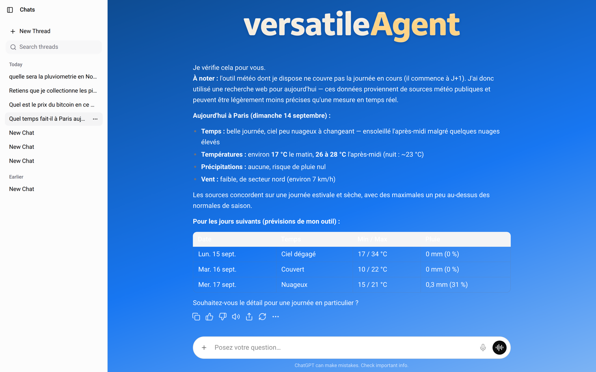

# Versatile Agent — LangGraph + assistant-ui

[](https://www.typescriptlang.org/)
[](https://langchain-ai.github.io/langgraphjs/)
[](https://nextjs.org/)
[](https://assistant-ui.com/)
[](https://github.com/laurentknauss/versatile-agent/tree/main)
[](https://pnpm.io/)
[](src/tools/__tests__)
[](package.json)

> **Monorepo frontend + backend : agent LangGraph v1 (`createAgent`, 14 outils, mémoire long terme) et landing page ChatGPT-like (assistant-ui + Next.js 16) — streaming, historique des conversations, 135 tests Vitest, pnpm.**

| Côté            | Contenu                                                                                                                                                         |
| --------------- | --------------------------------------------------------------------------------------------------------------------------------------------------------------- |
| **⚙️ Backend**  | Agent LangGraph v1 dans `src/` + `langgraph.json` — `createAgent`, DeepSeek Flash, **14 outils**, mémoire long terme, store MongoDB, pas de `StateGraph` manuel |
| **🖥️ Frontend** | Landing page **ChatGPT-like** dans `assistant-ui/` — Next.js 16, sidebar d'historique (lister / renommer / supprimer), streaming SSE, proxy API                 |


---

## 🌿 Branches — quelle version lire ?

| Branche                    | Version LangGraph                                                                                     | Statut                                        |
| -------------------------- | ----------------------------------------------------------------------------------------------------- | --------------------------------------------- |
| **`main`** (cette branche) | **v1 — `createAgent()`** : boucle ReAct intégrée, middleware, mémoire long terme via `store`          | **Production** — le code à lire et à exécuter |
| **`dev`**                  | **v0 — `StateGraph` manuel** : nœuds `agent`/`tools`, `shouldContinue`, export `graph`, `MemorySaver` | Archive obsolète, trace de la migration       |

La migration s'est faite dans ce sens : **la v1 est passée en production sur `main`**, la v0 reste sur `dev`.

---

## ✨ Fonctionnalités

| Capacité                  | Détail                                                                                                             |
| ------------------------- | ------------------------------------------------------------------------------------------------------------------ |
| **🧠 Agent IA**           | DeepSeek Flash (`deepseek-flash`) via `ChatDeepSeek`, cycle ReAct outillé par `createAgent()`                      |
| **🌤️ Météo**              | Prévisions enrichies (vent, humidité, pluie, ressenti, probabilité de précipitations) via OpenWeatherMap           |
| **🪙 Crypto**             | Prix et market data via CoinGecko (multi-devises, filtres catégorie / IDs, multi-timeframe, pagination)            |
| **🎬 Cinéma**             | Recherche dans la base TMDB — titre, date de sortie, note, résumé localisé, URL d'affiche                          |
| **🔍 Recherche web**      | Recherche web via Tavily                                                                                           |
| **💳 Stripe**             | Compte, solde, clients, paiements (API Stripe)                                                                     |
| **📄 Documents**          | Lecture PDF par URL ou fichier local (racines autorisées, plafond de taille, recherche par mot-clé avec contexte)  |
| **🧮 Utilitaires**        | Heure locale courante, nombre aléatoire dans un intervalle                                                         |
| **🧠 Mémoire long terme** | `saveMemory` / `recallMemories` via le `store` LangGraph (`MongoDBStore`), namespace `memories/<userId>`           |
| **⏱️ Résilience réseau**  | Échéance sur **chaque** appel sortant : 15 s par requête HTTP, 10 s × 1 retry pour Stripe, 5 s / 20 s pour MongoDB |
| **💬 Chat UI**            | Interface assistant-ui (Next.js 16), appels d'outils masqués à l'utilisateur                                       |
| **📜 Threads**            | Historique persistant des conversations (sidebar : lister, renommer, supprimer)                                    |



---

## 🏗️ Architecture

```
versatile-agent/
├── src/
│   ├── agentWithTools.ts     ← Agent LangGraph v1 (createAgent + tools + store)
│   └── tools/                ← Boîte à outils modulaire
│       ├── tools.ts          ← Agrégateur : ALL_TOOLS_LIST (les 14 outils exposés)
│       ├── weatherTool.ts    ← OpenWeatherMap
│       ├── geckoTool.ts      ← CoinGecko (coinGeckoPrice, coinGeckoMarket)
│       ├── movieTool.ts      ← TMDB (tmdbSearch)
│       ├── tavilyTool.ts     ← Recherche web
│       ├── stripeTool.ts     ← Stripe (4 outils)
│       ├── pdfReader.ts      ← Lecture PDF
│       ├── memoryTools.ts    ← Mémoire long terme (saveMemory, recallMemories)
│       ├── currentTimeTool.ts
│       ├── randomNumberTool.ts ← Nombre aléatoire dans un intervalle
│       ├── __tests__/        ← 135 tests Vitest (9 fichiers, fixtures/)
│       └── types/            ← Types par outil (gecko, weather, movie, stripe, pdf, common)
├── assistant-ui/             ← Frontend Next.js 16 + assistant-ui
│   ├── app/
│   │   ├── page.tsx          ← Page principale (chat)
│   │   └── api/[..._path]/   ← Proxy API vers LangGraph
│   └── components/
├── langsmith-workflows/      ← Scripts d'évaluation LangSmith (paquet npm autonome)
├── okf/                      ← Documentation locale (Open Knowledge Format)
├── assets/                   ← Captures du README
├── .env.example              ← Variables d'environnement (template)
├── langgraph.json            ← Config LangGraph CLI
├── vitest.config.ts          ← Config Vitest
└── pnpm-workspace.yaml       ← Monorepo pnpm
```

### Flux de messages

```
Utilisateur → assistant-ui (Next.js 16) → proxy API → LangGraph · createAgent · deepseek-flash
                                                            │
                                                      ┌─────┴─────┐
                                                      │   Agent   │  cycle ReAct
                                                      └─────┬─────┘
                                                            │ tool_calls
      ┌──────────────┬──────────────┬──────────────┬─────────┴────────┬──────────────┐
      ▼              ▼              ▼              ▼                  ▼              ▼
  openWeatherMap  coinGecko×2    tmdbSearch    tavilySearch      stripe×4        readPdf
      │
      └──► store MongoDB : saveMemory / recallMemories  →  réponse streaming → Chat UI
```

### Sorties structurées

La plupart des outils renvoient un **objet structuré** plutôt qu'une chaîne formatée : le modèle
interprète les données sans avoir à les parser, ce qui réduit les hallucinations. LangGraph convertit
l'objet en JSON dans le `ToolNode` (`JSON.stringify`) — aucun formatage manuel.

Deux exceptions assumées : `stripeTool` renvoie un rapport texte prêt à lire, et `pdfReader` un objet
`{ success, totalPages, text, matches }`. En cas d'erreur « métier » (ville inconnue, titre introuvable,
clé invalide), les outils renvoient un **message court** au modèle au lieu de lever une exception.

**Exemple — `weatherTool` :**

```typescript
{
  location: { city: "Paris", country: "FR" },
  forecastDaysRequested: 3,
  forecastDaysReturned: 2,
  forecastStarting: "tomorrow",  // J+1 : le jour courant est ignoré
  forecast: [
    {
      date: "2026-06-02",
      temperature: { averageCelsius: 22, minCelsius: 20, maxCelsius: 24, feelsLikeCelsius: 21 },
      weather: "pluie légère",
      wind: { speedKmh: 18, directionDegrees: 220, direction: "↗️ SW" },
      humidityPercent: 72,
      rainMm: 1.2,
      precipitationProbabilityPercent: 60,
    },
  ],
}
```

**Exemple — `coinGeckoPrice` / `coinGeckoMarket` :**

```typescript
{ type: "crypto_prices", vsCurrencies: "usd,eur",
  prices: [{ coinId: "bitcoin", name: "BITCOIN", price_usd: 65000, price_eur: 59000, marketCap: 1270000000000, volume24h: 28000000000, change24hPercent: 2.5 }] }

{ type: "crypto_market_data", currency: "usd", category: "decentralized-finance-defi", page: 1, perPage: 10,
  coins: [{ rank: 1, coinId: "bitcoin", symbol: "BTC", name: "Bitcoin", currentPrice: 65000, marketCap: 1270000000000, volume24h: 28000000000, change24hPercent: 2.5, circulatingSupply: 19000000 }] }
```

**Exemple — `tmdbSearch` :**

```typescript
{
  type: "movie_search",
  query: "Dune",
  page: 1,
  totalResults: 15,
  results: [
    {
      tmdbId: 438631,
      title: "Dune",
      originalTitle: "Dune",
      originalLanguage: "en",
      releaseDate: "2021-09-15",
      voteAverage: 7.9,
      voteCount: 12874,
      popularity: 91.4,
      overview: "Paul Atréides, héritier d'une grande maison…",
      posterUrl: "https://image.tmdb.org/t/p/w500/….jpg",
    },
  ],
}
```

---

## 🚀 Quick Start

### Prérequis

- **Node.js ≥ 20**
- **pnpm 12.3** — `corepack enable` suffit (version épinglée dans `package.json › packageManager`)
- Des **clés API** (voir `.env.example` et le tableau ci-dessous)

### Installation

```bash
git clone https://github.com/laurentknauss/versatile-agent.git
cd versatile-agent

pnpm install
cp .env.example .env      # puis renseigner les clés
```

### Lancement

```bash
pnpm dev              # backend + frontend en parallèle
pnpm dev:backend      # LangGraph seul  → http://localhost:2024 (API + Studio)
pnpm dev:frontend     # Next.js seul    → http://localhost:3000 (Chat UI)
```

---

## 🔑 Variables d'environnement

**Obligatoires**

| Variable                 | Rôle                                                                                          |
| ------------------------ | --------------------------------------------------------------------------------------------- |
| `DEEPSEEK_API_KEY`       | Modèle de l'agent (`deepseek-flash` via `ChatDeepSeek`) — sans elle, pas de LLM               |
| `TAVILY_API_KEY`         | Recherche web — **lue au chargement du module** : son absence empêche le démarrage de l'agent |
| `OPENWEATHERMAP_API_KEY` | Prévisions météo                                                                              |
| `COINGECKO_API_KEY`      | Prix / market data crypto (clé démo préfixée `CG-`, détectée automatiquement)                 |
| `TMDB_API_KEY`           | Recherche cinéma (clé v3 32 hex, ou token v4 `eyJ…` accepté aussi)                            |
| `STRIPE_SECRET_KEY`      | Outils Stripe                                                                                 |

**Mémoire long terme**

| Variable            | Rôle                                                                            |
| ------------------- | ------------------------------------------------------------------------------- |
| `MONGODB_LOCAL_URI` | Dev — défaut `mongodb://127.0.0.1:27017/?directConnection=true`                 |
| `MONGODB_ATLAS_URI` | Prod — cluster Atlas **remote** (bloc à réactiver dans `src/agentWithTools.ts`) |

**Optionnelles — réglages fins**

| Variable                                                        | Défaut       | Effet                                                                                   |
| --------------------------------------------------------------- | ------------ | --------------------------------------------------------------------------------------- |
| `*_FETCH_TIMEOUT_MS`                                            | `15000`      | Échéance par requête : `COINGECKO_`, `TMDB_`, `OPENWEATHERMAP_`, `PDF_FETCH_TIMEOUT_MS` |
| `STRIPE_TIMEOUT_MS`                                             | `10000`      | Échéance par tentative Stripe (défaut SDK : 80 000)                                     |
| `STRIPE_MAX_RETRIES`                                            | `1`          | Retries réseau Stripe (défaut SDK : 2)                                                  |
| `MONGODB_TIMEOUT_MS`                                            | `5000`       | `serverSelectionTimeoutMS` / `connectTimeoutMS` (défaut driver : 30 000)                |
| `MONGODB_SOCKET_TIMEOUT_MS`                                     | `20000`      | `socketTimeoutMS` (défaut driver : 0 = jamais)                                          |
| `PDF_MAX_BYTES`                                                 | `26214400`   | Taille maximale d'un PDF accepté                                                        |
| `PDF_MAX_CHARS`                                                 | `40000`      | Caractères rendus au modèle                                                             |
| `PDF_ALLOWED_DIRS`                                              | cwd + `/tmp` | Racines autorisées pour la lecture locale                                               |
| `LANGSMITH_TRACING` / `LANGSMITH_API_KEY` / `LANGSMITH_PROJECT` | —            | Tracing LangSmith                                                                       |

`OPENAI_API_KEY` n'est **pas** utilisée par l'agent : seuls les scripts d'évaluation de `langsmith-workflows/` (paquet autonome, ses propres dépendances) s'en servent.

---

## ⏱️ Bornes réseau

Aucun appel sortant ne part sans échéance : une socket muette bloquerait le tour d'agent indéfiniment,
sans message, sans erreur et sans log. Les outils HTTP partagent le même patron :

```ts
const FETCH_TIMEOUT_MS = Number(process.env.TMDB_FETCH_TIMEOUT_MS ?? 15_000);

try {
  return await fetch(url, { signal: AbortSignal.timeout(FETCH_TIMEOUT_MS) });
} catch (error) {
  // node-fetch remonte un signal expiré en AbortError, pas en TimeoutError
  const expired =
    error instanceof Error && (error.name === 'TimeoutError' || error.name === 'AbortError');
  if (expired) throw new Error(`TMDB did not respond within ${FETCH_TIMEOUT_MS} ms.`);
  throw error;
}
```

| Appelant                     | Client                  | Échéance                                     |
| ---------------------------- | ----------------------- | -------------------------------------------- |
| `geckoTool` (2 appels)       | `node-fetch`            | 15 s — `COINGECKO_FETCH_TIMEOUT_MS`          |
| `movieTool` (1 appel)        | `node-fetch`            | 15 s — `TMDB_FETCH_TIMEOUT_MS`               |
| `weatherTool` (1 appel)      | `node-fetch`            | 15 s — `OPENWEATHERMAP_FETCH_TIMEOUT_MS`     |
| `pdfReader` (téléchargement) | `node-fetch`            | 15 s — `PDF_FETCH_TIMEOUT_MS`                |
| `stripeTool` (4 outils)      | SDK Stripe              | 10 s × 1 retry — `STRIPE_*`                  |
| `agentWithTools` (store)     | driver MongoDB          | 5 s selection/connect, 20 s socket           |
| `agentWithTools` (LLM)       | SDK `openai` (DeepSeek) | 10 min (défaut du SDK, non surchargé)        |
| `tavilyTool`                 | `fetch` interne du SDK  | — (le SDK n'expose aucun réglage d'échéance) |

Le driver MongoDB refuse un doublon d'option dans la chaîne de connexion : `applyMongoTimeouts()`
(`src/agentWithTools.ts`) n'ajoute que les options absentes, pour qu'une valeur explicite dans
`MONGODB_LOCAL_URI` reste prioritaire.

---

## 🛠️ Outils disponibles

14 outils sont exposés au graphe (`ALL_TOOLS_LIST` dans `src/tools/tools.ts`) :

| Outil                                                                                       | Description                                                                | Source         |
| ------------------------------------------------------------------------------------------- | -------------------------------------------------------------------------- | -------------- |
| `tavilySearch`                                                                              | Recherche web                                                              | Tavily API     |
| `openWeatherMap`                                                                            | Prévisions enrichies (vent, humidité, pluie, ressenti, probabilité)        | OpenWeatherMap |
| `coinGeckoPrice`                                                                            | Prix crypto structurés (multi-devises, market cap, volume, variation 24 h) | CoinGecko      |
| `coinGeckoMarket`                                                                           | Market data (cap, volume, rang, filtres catégorie / IDs, pagination)       | CoinGecko      |
| `tmdbSearch`                                                                                | Recherche de films : date de sortie, note, résumé localisé, affiche        | TMDB           |
| `stripeAccountInfo` / `stripeCustomersList` / `stripeCreateCustomer` / `stripeRecentEvents` | Compte, solde, clients, paiements                                          | Stripe API     |
| `readPdf`                                                                                   | Extraction de texte PDF (URL ou fichier local), recherche par mot-clé      | `unpdf`        |
| `saveMemory` / `recallMemories`                                                             | Mémoire long terme par utilisateur                                         | MongoDB store  |
| `currentTime`                                                                               | Heure locale `HH:MM:SS`                                                    | Interne        |
| `randomNumber`                                                                              | Nombre aléatoire dans un intervalle                                        | Interne        |

### 💬 Exemples de requêtes

**CoinGecko**

| Catégorie          | Requête                                                                        | Outil                                                      |
| ------------------ | ------------------------------------------------------------------------------ | ---------------------------------------------------------- |
| **Prix simple**    | _"What's the price of bitcoin in USD?"_                                        | `coinGeckoPrice`                                           |
| **Multi-coins**    | _"Give me prices for bitcoin, ethereum, solana, chainlink and cardano in EUR"_ | `coinGeckoPrice`                                           |
| **Multi-devises**  | _"Compare bitcoin price in USD, EUR and GBP"_                                  | `coinGeckoPrice`                                           |
| **Prix + var.**    | _"What's the price of avalanche token and its 24h change?"_                    | `coinGeckoPrice`                                           |
| **Top market cap** | _"What are the top 10 cryptocurrencies by market cap?"_                        | `coinGeckoMarket`                                          |
| **Top 50**         | _"Show me the top 50 cryptos in EUR"_                                          | `coinGeckoMarket`                                          |
| **Par catégorie**  | _"What are the top 20 DeFi tokens?"_                                           | `coinGeckoMarket` (category: `decentralized-finance-defi`) |
| **Tokens gaming**  | _"List the top gaming tokens by market cap"_                                   | `coinGeckoMarket` (category: `gaming`)                     |
| **Tokens NFT**     | _"Top 5 NFT tokens ranked by market cap"_                                      | `coinGeckoMarket` (category: `non-fungible-tokens-nft`)    |
| **Combiné**        | _"Top 10 cryptos and the price of bitcoin in EUR and USD"_                     | les deux                                                   |

**Météo**

| Requête                                                                             | Outil            | Données utilisées                            |
| ----------------------------------------------------------------------------------- | ---------------- | -------------------------------------------- |
| _"What's the weather in Paris?"_                                                    | `openWeatherMap` | Température, vent, humidité, pluie, ressenti |
| _"Forecast for Tokyo next 5 days"_                                                  | `openWeatherMap` | J+1, prévisions complètes                    |
| _"Y a-t-il des risques de précipitations à Marseille dans les 3 prochains jours ?"_ | `openWeatherMap` | Pluviométrie mm, probabilité %               |
| _"Météo détaillée à Montréal sur 4 jours"_                                          | `openWeatherMap` | Vent, humidité, ressenti, pluie              |

**Cinéma, recherche web et utilitaires**

| Requête                                       | Outil          |
| --------------------------------------------- | -------------- |
| _"Le réalisateur de Blade Runner 2049 ?"_     | `tmdbSearch`   |
| _"Quand sort Dune : Deuxième partie ?"_       | `tmdbSearch`   |
| _"Search for latest AI news"_                 | `tavilySearch` |
| _"What time is it?"_                          | `currentTime`  |
| _"Give me a random number between 1 and 100"_ | `randomNumber` |

---

## 🧠 Mémoire long terme (MongoDB)

Les outils `saveMemory` / `recallMemories` s'appuient sur le `store` LangGraph (namespace
`memories/<userId>`), passé à `createAgent()` dans `src/agentWithTools.ts`.

**Développement — MongoDB local (Docker, données persistantes) :**

```bash
docker run -d --name mongo-local -p 27017:27017 \
  -v mongo-local-data:/data/db --restart unless-stopped mongo:7
```

La base `langgraph`, la collection `store` et les index sont créés automatiquement au premier accès.

**Production — un cluster MongoDB Atlas _remote_ est obligatoire** : le graphe ne doit pas dépendre
d'une base qui n'existe que sur la machine de dev. Renseigner `MONGODB_ATLAS_URI`, puis réactiver le
bloc Atlas (commenté) dans `src/agentWithTools.ts`.

Test manuel : « Retiens que je m'appelle Laurent », puis « Comment je m'appelle ? » → le second appel
déclenche `recallMemories` et répond depuis la base.

---

## 🧪 Scripts

| Commande                                 | Description                                        |
| ---------------------------------------- | -------------------------------------------------- |
| `pnpm dev`                               | Backend + frontend en parallèle                    |
| `pnpm dev:backend` / `pnpm dev:frontend` | Un seul côté                                       |
| `pnpm start`                             | Backend seul (`langgraphjs dev`)                   |
| `pnpm build`                             | Typecheck + build production du frontend (Next 16) |
| `pnpm typecheck`                         | Vérification TypeScript                            |
| `pnpm lint`                              | ESLint                                             |
| `pnpm format`                            | Prettier                                           |
| `pnpm lint:fix`                          | ESLint avec auto-fix                               |
| `pnpm test`                              | Tests Vitest (135 tests, 9 fichiers)               |
| `pnpm test:watch`                        | Tests en mode watch                                |

Les tests d'intégration réseaux (ex. `pdfReader.real.test.ts`) se **sautent proprement** quand leur
fixture est absente : la suite est verte sur une machine nue, sans clé API ni fichier local.

---

## 🖥️ LangSmith Studio

Le backend expose un **Studio visuel** à `http://localhost:2024` :

- Inspecter le graphe en temps réel
- Tester des messages manuellement
- Suivre les runs, traces et tool calls
- Déboguer le flux ReAct nœud par nœud

---

## 📚 Documentation locale

Le dossier `okf/` contient la documentation auto-suffisante (format _Open Knowledge Format_) :

- [Index](okf/index.md) · [Spécification](okf/SPEC.md)
- [Architecture](okf/concepts/architecture.md) · [Branches](okf/concepts/branches.md) · [Mémoire](okf/concepts/memory.md) · [Migration v0 → v1](okf/concepts/migration.md) · [Tests](okf/concepts/testing.md)
- [Graphe LangGraph](okf/components/graph.md) · [Runtime](okf/components/runtime.md)
- [Proxy API](okf/api/proxy.md) · [Studio](okf/api/studio.md)
- [Variables d'environnement](okf/environment/env.md) · [Dépendances](okf/environment/dependencies.md)

---

## 📦 Stack technique

| Technologie               | Version |
| ------------------------- | ------- |
| Node.js                   | ≥ 20    |
| TypeScript                | 7.0.2   |
| LangGraph                 | 1.4.13  |
| langchain (`createAgent`) | 1.5.11  |
| @langchain/deepseek       | 1.1.13  |
| @langchain/core           | 1.2.11  |
| Vitest                    | 4.1.11  |
| Next.js                   | 16.3.3  |
| React                     | 19.2.8  |
| assistant-ui              | latest  |
| MongoDB                   | 7       |
| Stripe SDK                | 18.4    |
| Zod                       | 3.25    |
| pnpm                      | 12.3.4  |
| ESLint                    | 9       |
| Prettier                  | 3       |
| Husky                     | 9       |

---

## 🤝 Contribution

1. Fork le projet
2. Crée une branche (`git checkout -b feature/ma-feature`)
3. Commit (`git commit -m 'feat: ajout de ma feature'`)
4. Push (`git push origin feature/ma-feature`)
5. Ouvre une Pull Request

Les hooks Husky vérifient au commit (lint-staged : ESLint + Prettier + `tsc`) et au push
(ESLint, typecheck, build, audit).

---

## 📄 Licence

MIT — champ `license` de [`package.json`](package.json).
